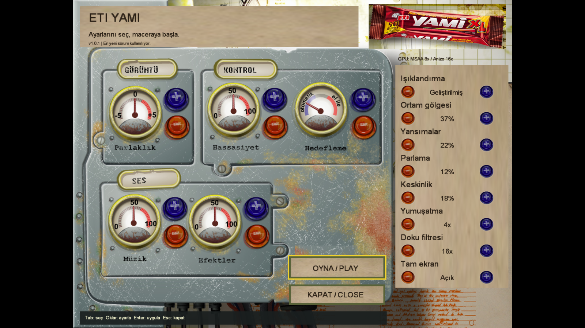

# ETI Yami Native — Linux

A native C++20/SDL3 reconstruction of **ETI Yami**, using the original game's artwork, models, scripts, audio, and videos. Includes an original-style settings launcher, OpenGL/GLES rendering, widescreen support, and automatic launcher/engine updates. No Wine, DirectX installer, or Windows codec installation is needed.

**The original game assets are not included in this repository or release downloads. You need a legitimate copy of the original game.** Linux releases are available for x86_64 and ARM64; Windows/macOS releases are deferred.

[Install](#install-on-linux-recommended-appimage) · [Manual ZIP](#advanced-manual-zip-installation) · [Controls](#game-controls) · [Saves](#saves-and-settings) · [Updates](#automatic-updates) · [Source build](#build-from-source) · [Troubleshooting](#troubleshooting) · [Checks](#checks-and-technical-details)

## Install on Linux (recommended: AppImage)

Download the installer for your CPU from [the latest public release](https://github.com/sergen213/etiyami/releases/latest). No GitHub account or token is required.

| Computer | Recommended installer | Shell fallback | Advanced manual package |
|---|---|---|---|
| Intel/AMD 64-bit Linux | [x86_64 AppImage](https://github.com/sergen213/etiyami/releases/latest/download/yami-setup-linux-x86_64.AppImage) | [x86_64 .run](https://github.com/sergen213/etiyami/releases/latest/download/yami-setup-linux-x86_64.run) | [x86_64 ZIP](https://github.com/sergen213/etiyami/releases/latest/download/yami-linux-x86_64.zip) |
| 64-bit ARM Linux | [ARM64 AppImage](https://github.com/sergen213/etiyami/releases/latest/download/yami-setup-linux-arm64.AppImage) | [ARM64 .run](https://github.com/sergen213/etiyami/releases/latest/download/yami-setup-linux-arm64.run) | [ARM64 ZIP](https://github.com/sergen213/etiyami/releases/latest/download/yami-linux-arm64.zip) |

Requirements: **glibc 2.35 or newer**, your distribution's graphics drivers and C++ runtime, and an OpenGL 3.3 or GLES 3-capable desktop. Installers bundle application libraries and the offline ISO extraction tool, **not** glibc, `libstdc++`, `libgcc`, or graphics drivers. No Wine, root access, separately installed 7-Zip, or manual asset extraction is needed. ARM64 release builds do not imply physical ARM GPU/gameplay verification; live gameplay verification has been performed on x86_64 Linux.

### 1. Run the installer

For an x86_64 download saved in `~/Downloads`:

```sh
chmod +x "$HOME/Downloads/yami-setup-linux-x86_64.AppImage"
"$HOME/Downloads/yami-setup-linux-x86_64.AppImage"
```

For ARM64, substitute `arm64` for `x86_64`. The AppImage uses a static runtime with automatic extraction fallback when FUSE is unavailable; it does not require installing FUSE2. To explicitly run without FUSE:

```sh
"$HOME/Downloads/yami-setup-linux-x86_64.AppImage" --appimage-extract-and-run
```

Alternatively, the `.run` download opens the same installer:

```sh
chmod +x "$HOME/Downloads/yami-setup-linux-x86_64.run"
"$HOME/Downloads/yami-setup-linux-x86_64.run"
```

The `.run` wrapper needs the ordinary shell, `tar`, `gzip`, and coreutils supplied by standard Linux installations. Run either format as your normal desktop user, **never with sudo**.

### 2. Choose your ISO, install, and launch

1. Click **Choose ISO** and select your legally owned original Turkish Yami game ISO. The installer reads its MSI/CAB data natively; it never executes the disc's Windows setup or codec/DirectX installers.
2. Wait for the original artwork and bitmap font to load from that ISO into a private temporary preview.
3. Keep the default installation location, `${XDG_DATA_HOME:-$HOME/.local/share}/etiyami`, or click **Change...** to select a parent folder; the installer creates `etiyami` inside it.
4. Click **Install game**, then **Launch game**. Application-menu and Desktop shortcuts are created automatically using the original game icon. Your desktop may ask you to trust/allow launching its shortcut.

The ISO can remain anywhere you can read it; you do **not** need to move it beside the installer or game. It is **not needed after installation**. Installation works offline once you have downloaded the installer. Allow 640 MiB free temporary space for the artwork preview and 1.5 GiB plus the native engine on the installation volume for extraction/staging.

**Tab / Shift+Tab** moves between installer controls, **Enter / Space** activates them, and **Escape** cancels a preview/installation or closes an idle installer. Cancellation cleans private staging rather than publishing a partial fresh installation.

Running Install again against a valid installer-owned installation preserves its existing assets, engine, settings, and saves and repairs its own shortcuts; it is not an engine downgrade/replacement. Unrelated folders, symlink destinations, and unrelated shortcuts are refused rather than overwritten. Use the launcher's automatic updates for new engine versions.

### 3. Play

Launch opens the settings launcher. Choose **OYNA / PLAY**, then **Yeni Oyun / New Game** in the game's main menu. Subsequently use the application-menu or Desktop shortcut; the downloaded installer is no longer required.

## Advanced: manual ZIP installation

Use the ZIP only if you already have an extracted original asset tree or want to manage the installation yourself.

Extract the **entire ZIP**, keeping its libraries beside the executables. Use a directory you can write to so automatic updates can install without administrator access. For an x86_64 download saved in `~/Downloads`:

```sh
mkdir -p "$HOME/Games/etiyami"
unzip "$HOME/Downloads/yami-linux-x86_64.zip" -d "$HOME/Games/etiyami"
cd "$HOME/Games/etiyami"
```

For ARM64, substitute `yami-linux-arm64.zip` in the extraction command.

### 2. Supply the original assets

Copy your original game's complete `game/` directory beside the executables. The layout should include:

```text
etiyami/
├── yami-launcher
├── yami-native
├── yami-updater
├── lib*.so*                  # Keep all supplied application libraries
└── game/
    └── data/
        ├── menu/menulist.xml
        └── ...               # All other original data, not just the menu
```

Alternatively, leave the original files where they are and pass `--asset-root` when launching. The asset root is the folder **containing `data/`**, not `data/` itself:

```sh
./yami-launcher --asset-root "/path/to/original/game"
```

See [extracting from the original installer](#extracting-from-the-original-installer) below if you have the MSI/CAB rather than an extracted game directory.

### 3. Start the launcher

```sh
./yami-launcher
```

Choose your settings, then click **OYNA / PLAY**. In the game's main menu, choose **Yeni Oyun / New Game** to start.

The launcher exposes the same 13 settings as the in-game **Ayarlar / Settings** screen: brightness, sensitivity, aiming mode, music/effects volume, lighting, ambient occlusion, reflections, bloom, sharpening, MSAA, texture filtering, and fullscreen. It stays windowed while you configure settings; the saved fullscreen choice applies when you press Play.

Keyboard navigation: **Tab / Shift+Tab** selects a control, **arrow keys** adjust it, **Enter / Space** activates it, and **Escape** closes the launcher. Mouse buttons apply changes on release. Closing saves settings without starting the game.



## Game controls

| Input | Action |
|---|---|
| W / Up, S / Down | Move forward / backward |
| A / Left, D / Right | Move left / right |
| Mouse | Camera and original menu cursor |
| Ctrl or left mouse button | Fire |
| Space | Special action |
| E or Enter | Interact |
| Tab | Objectives |
| Escape | Game menu |
| F11 | Toggle fullscreen |

Mouse capture is released when the game loses focus.

## Saves and settings

Original assets are read-only. Native checkpoints and `game.ini` are stored separately, using SDL's per-user preference directory. On Linux this is normally `${XDG_DATA_HOME:-$HOME/.local/share}/ETI/YamiNative/`.

To choose a different location:

```sh
./yami-launcher --save-dir "$HOME/Games/etiyami-saves"
```

Keep this directory **outside the original asset tree**. The launcher and game share the same settings file; automatic updates preserve the asset and save-directory choices.

## Automatic updates

Start **`yami-launcher`** to check for new releases in the background. A newer matching Linux package is downloaded over HTTPS, checked against GitHub's SHA256 digest, installed by the trusted local update helper, and the launcher restarts automatically. Updates contain engine/launcher files and application libraries, **not original assets or saves**.

- **No GitHub account, authorization code, or token is required** for public releases.
- Keep all three executables and their supplied libraries together in a writable installation directory.
- Offline operation or an unavailable update leaves the installed game playable.
- Use `./yami-launcher --no-updates` to disable network checks.
- Direct `yami-native` gameplay does **not** check for updates; use the launcher to update.

## Build from source

The AppImage installer is the easiest way to play. To build on Arch Linux / CachyOS:

```sh
sudo pacman -S --needed git gcc cmake ninja pkgconf sdl3 libepoxy libxml2 ffmpeg curl libarchive json-c

git clone https://github.com/sergen213/etiyami.git
cd etiyami
```

Supply the original assets as described above, placing `game/` at the repository root, then build and launch:

```sh
cmake -S . -B build -G Ninja -DCMAKE_BUILD_TYPE=Release
cmake --build build --parallel
./build/yami-launcher
```

For other distributions, install equivalent development packages: a C++20 compiler, CMake 3.20+, Ninja, pkg-config, SDL3, libepoxy, libxml2, FFmpeg (`libavformat`, `libavcodec`, `libavutil`, `libswscale`, `libswresample`), libcurl 7.85+, libarchive, and json-c. FFmpeg must include the Indeo 5/JPEG/TGA/BMP decoders and PNG encoder. **SDL2 is not a substitute for SDL3.** The Linux release workflow builds its dependencies on Ubuntu 22.04; distribution packages may be too old for a source build.

### Build the Linux ISO installer

The Linux source build also provides `yami-setup`. Unlike release installers, a source invocation needs an engine directory containing the three native executables and their required libraries, plus a trusted `7zz` executable:

```sh
cmake --build build --target yami-setup
./build/yami-setup --engine "$PWD/build" --archiver "/absolute/path/to/7zz"
```

Select your original ISO in the GUI; pre-extracting `game/` is not required for this path. Source builds use your installed development/runtime dependencies rather than the release's bundled library set.

### Extracting from the original installer

The repository's `extract_game.py` supports the original Turkish Yami MSI/CAB release. Place your legitimate **`Yami.msi`** and **`Data1.cab`** at the repository root, then on Arch/CachyOS run:

```sh
sudo pacman -S --needed python 7zip cabextract
python3 extract_game.py
```

This reads the installer tables and CAB without running a Windows installer, validates the extracted files, and creates `game/`. It refuses to overwrite an existing `game/`. It is specific to this original release, not a general MSI extractor. Installer archives and original data are excluded from Git; do not commit or redistribute them without the appropriate rights.

## Useful launch options

Examples below use the downloaded executables; for a source build, prefix them with `./build/` instead of `./`.

```sh
# Direct gameplay, bypassing the settings launcher
./yami-native --skip-intro

# Use GLES instead of the default OpenGL backend
./yami-launcher --gles

# Original lighting without the enhanced world effects
./yami-launcher --classic-graphics

# Lower-cost graphics settings
./yami-launcher --samples 0 --anisotropy 1 --ao 0 --reflections 0 --bloom 0 --sharpen 0

# Print the installed version or all supported options
./yami-native --version
./yami-native --help
```

Effect strengths accept values from `0` to `1`; zero disables that effect. CLI graphics options override saved values, while edits made in the launcher take precedence before Play. `yami-native --launcher` opens the same launcher interface.

## Troubleshooting

- **Original assets not found:** check that `game/data/menu/menulist.xml` exists and that the complete original data was copied. Use `--asset-root "/path/to/game"` if it is stored elsewhere.
- **Permission denied when launching:** if your extractor lost executable permissions, run `chmod +x yami-launcher yami-native yami-updater` in the extracted directory. Do not run the game as root.
- **Update cannot install:** move the whole installation to a per-user writable directory, such as `~/Games/etiyami`; keep its libraries and update helper together.
- **EGL/OpenGL startup error:** ensure your host graphics drivers and C++ runtime are current. The withdrawn 1.0.0 package could conflict with newer Mesa; repair that installation by extracting the latest fixed package into the same directory. Do not add its old bundled C++ libraries to `LD_LIBRARY_PATH`.
- **Wayland-specific issue:** Linux prefers Wayland when available. To explicitly try X11 on a desktop that provides it, run `SDL_VIDEO_DRIVER=x11 ./yami-launcher`.
- **Poor performance:** reduce MSAA, filtering, or effects in Ayarlar, or use the lower-cost CLI example above.

## Checks and technical details

From a source checkout with the original `game/` data and a running graphical desktop:

```sh
ctest --test-dir build --output-on-failure
./build/yami-native --smoke --skip-intro --no-updates
```

```sh
# Optional Linux installer regression using your own original ISO
cmake --build build --target check_setup_install
./build/check_setup_install "/path/to/original.iso" "$PWD/build" \
  "/absolute/path/to/7zz" "/path/to/new-isolated-check-directory"
```

The smoke command exercises real menu input, New Game, gameplay, and rendering; it needs an actual focused window. Keep the mouse/keyboard idle and do not switch windows during this automated check: concurrent physical input or focus loss intentionally fails it. By default it uses a new temporary save directory. Existing checks cover assets, scripts, gameplay, audio, settings, rendering, and safe update installation. Full campaign progression has not been manually played end-to-end.

The optional installer check performs real extraction and isolated install/cancellation/safety/shortcut checks. Its final directory argument must not already exist; it creates an installation there and needs the same free space as an ordinary install. These commands are instructions, not a claim that your ISO or desktop has already been verified.

For reconstruction notes, implementation details, and verification evidence, see [REVERSE_ENGINEERING.md](REVERSE_ENGINEERING.md).
